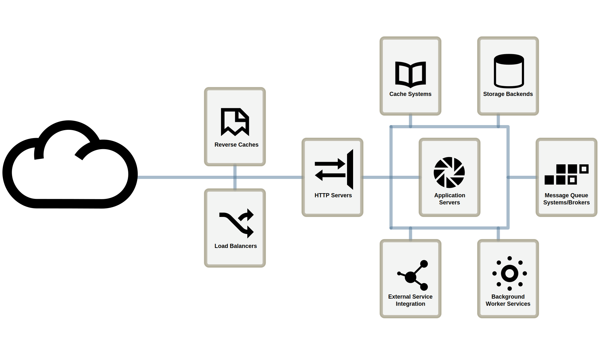

## Infrastructures

http://berb.github.io/diploma-thesis/community/033_archmodel.html

---

+ design for scale
    - 后面主要是讲通过将系统拆分为组件
    - 借由增强组件的水平扩展能力，增强整个系统的可扩展性
    - 组件的扩展，主要是通过 clone/split/replicate
    - 关于设计和实现时的冗余，作者举了几个值。
        设计阶段以 20x 的性能为目标，
        实现阶段以 3x 的性能为目标，
        部署时至少有 1.5x 的实际处理能力

+ design for failure
    - 冗余，避免因为单点故障导致瘫痪
    - 隔离，避免出现连环效应

---

日志监控等功能，下面都没提及。
数据是优化的前提条件，所以肯定还是要有的。

---

---

### HTTP server

+ 隔离请求和业务逻辑
+ 可以用于处理非业务逻辑，比如 TLS 加密解密、压缩、保持链接
+ 可以将不同的业务分发到不同的应用服务器上
+ scalability strategy: 因为本身是无状态的，所以可以直接复制节点的方式进行扩展
+ example: nginx, jetty

---

### application server

+ 接收请求，返回数据
+ 大部分组件都只和应用服务器打交道
+ scalability strategy: 做到无状态，只处理逻辑，需要共享的东西都放到数据层。
    做到无状态了，直接复制就好。

---

### load balancer & reverse cache

+ 个人观点，上个 nginx 挡在前面，有什么需求不能满足了再想别的
+ scalability strategy: 还是直接复制节点，这些节点本身的负载均衡可以由 DNS 提供
+ example: load balancer 有 haproxy/nginx，reverse proxy 有 varnish/nginx

---

### message queue system

+ 消息队列被用于不同组件的通信
+ scalability strategy: decentralized 能提供更好的扩展性（我没看懂）
+ example: zeromq, AMQP 协议

---

### backend data storage

+ 持久化的数据
+ scalability strategy: replication, partition (vertical), shard (horizontal)
+ example: MySQL, HBase, HDFS

---

### cache system

+ 缓存
+ scalability strategy: key/value 形式的缓存可以通过复制节点来扩展，
    配合一致性哈希将特定的 key 分配到特定的节点
+ example: redis

---

### background worker service

+ 将一些特定的需求，放到单独的机器上进行
+ 比如图片、视频的压缩处理，
+ scalability strategy: 加机器、加硬件
+ example: Hadoop, Spark

---

### external servces

+ 一些外部依赖
+ scalability strategy: 如果可控，就不叫外部了
+ example: 呃
